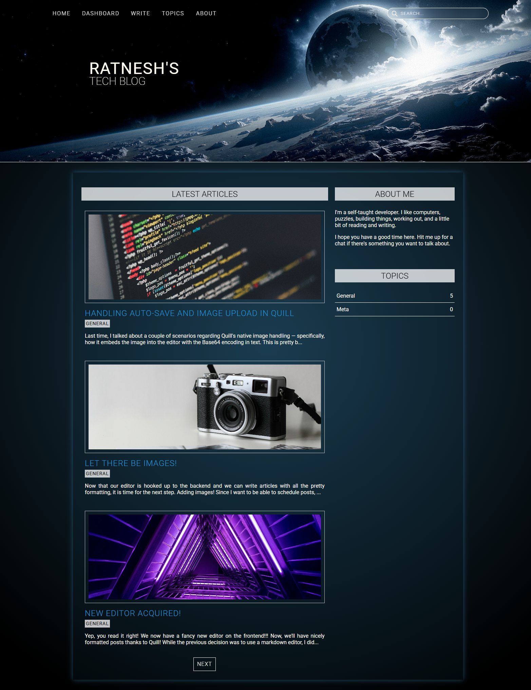
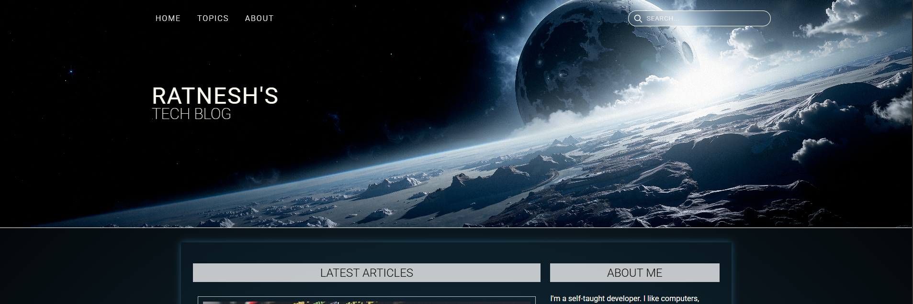

# dev-blog
A Blog written in Django + Vanilla JS to document my day-to-day dev work. Uses minimal JS on the frontend.

## Getting Started

- Setup a virtual environment.
- Install dependencies
    ```sh
    pip install -r requirements.txt
    ```
- Run the dev server
    ```sh
    python manage.py runserver
    ```
- App will be available at `localhost:8000`

The DB is also included in the repo with the latest articles.

## Screenshots and Features

As of this writing, much of the UI is still a work in progress. I've provided some of the main views below, though it is possible much of the layout has changed.

### Homepage

When logged in:



When not logged in, the navigation header has fewer options available:



The navigation header has a search bar which can be used to lookup articles:


TODO: Populate sidebar with most viewed articles and other widgets.

### Article Page


### Editor Interface

The blog uses [Quill](https://quilljs.com/) as its rich-text editor of choice. Enabled features are illustrated in the screenshot below:


Since Quill embeds uploaded images into the editor with a Base64 encoding as text, the image data is collected and uploaded upon saving/publishing. The returned URL then replaces the encoding. This is done to avoid sending the full image data on every save/auto-save while also supporting the usual undo-redo functionality in the editor.

TODO: Support more embeddings: videos, codepends, etc.

### Dashboard

Work in progress. Currently displays all articles (including drafts).

### Topics

Work in progress. Currently displays all topics and their respective article count.


### About

Work in progress. Currently redirects to the homepage.

## Deployment

As of this writing (05/12/2025), a version of the blog is deployed on PythonAnywhere at the following link: https://theyorouzoya.pythonanywhere.com/

> ![NOTE]
> Since PythonAnywhere requires a paid subscription to setup a CI/CD pipeline for GitHub deployments directly, I have to manually update the current version with the latest changes. As a result, the current version might not be up to date with the latest changes on this repo.